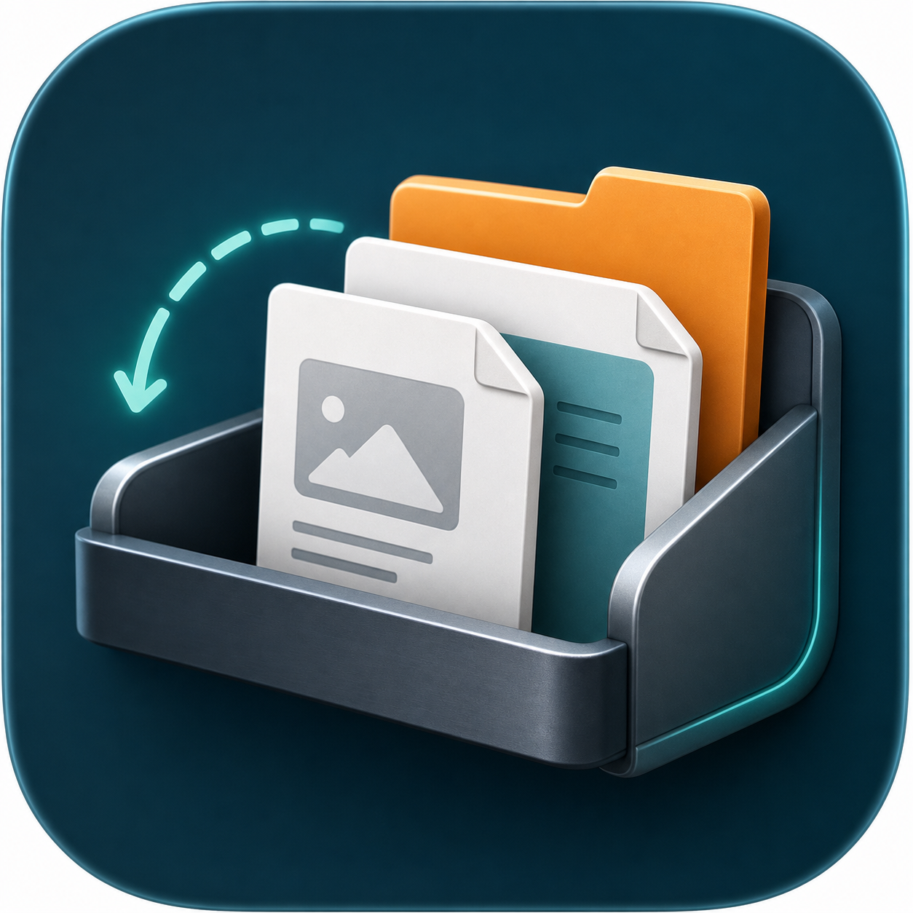

<p align="center">
  
  
</p>

<h1 align="center">FileShelf</h1>

<p align="center">
  A portable Windows file shelf for temporarily staging files and folders between Explorer windows or applications.
</p>

FileShelf stores file paths only. It does not copy, move, delete, modify, upload, or read file contents, and it does not manage clipboard history.

## Main Features

- Portable Windows app: no installer, registry keys, startup entries, shell extensions, or background services.
- Always-on-top shelf for temporary file and folder staging.
- Drag files or folders into the shelf; files dropped together stay as one group.
- Drag staged items back out through standard Windows file drag/drop.
- Successful drag-out removes unpinned entries from FileShelf only; source files stay untouched.
- Pin important shelf items so they remain after drag-out or clear operations.
- Stack selected shelf items into one group, or split a group back into separate entries.
- Restore recently removed entries during the current app session.
- Tray icon control: left click toggles the shelf, right click opens Settings, About, or Exit.
- Always-on-top floating folder icon: double-click opens the shelf panel, drag it to reposition, and drop files onto it to stage.
- Configurable shelf size preset, language, data path, and log path.
- Chinese and English interface switching.

## For Users

### Download and Run

Download the portable Windows build, unzip it, and run:

```text
FileShelf.Win.exe
```

No installation is required. Runtime data is stored beside the executable by default, so the app folder can be moved as a portable package.

### Typical Workflow

1. Drop one or more files or folders onto the floating folder icon, or double-click the icon and drop files into the shelf panel.
2. Double-click the floating icon to open the shelf panel when you need staged files.
3. Drag a staged item, selected items, or the item-count handle out of FileShelf.
4. Drop them into the target application. The panel collapses back to the floating icon when focus moves away.

### Controls

- Floating folder icon: double-click to open the shelf panel.
- Floating folder icon drag: move the icon to another screen position.
- Floating folder icon drop target: release files over the icon to stage them; moving away cancels the interaction.
- Focus change: collapse the shelf panel back to the floating icon.
- Tray left click: open or collapse the shelf panel.
- Tray right click: open Settings, About, or Exit.
- Shelf `+` button: add files or folders manually, or open shelf actions.
- Item context menu: open, reveal in Explorer, pin/unpin, stack, split, or remove.

### Safety and Portability

- Source files are never modified by FileShelf.
- Removing an item from the shelf only removes FileShelf's saved path metadata.
- Runtime state defaults to `FileShelfData` beside the executable.
- Settings are stored in `FileShelfData\settings.json`.
- Shelf metadata is stored in `FileShelfData\shelf.json`.
- Logs are stored in `FileShelfData\logs\fileshelf.log`.
- Build metadata is stored in `FileShelf.app.json` beside the executable when published; it controls About version text and update checks.
- FileShelf does not register global hotkeys or mouse hooks.
- If the app crashes, FileShelf leaves only its portable data and log files.

## For Developers

### Requirements

- Windows
- .NET SDK 10.x
- PowerShell

### Build From Source

Run from the repository root:

```powershell
dotnet restore FileShelf.sln -r win-x64
dotnet build FileShelf.sln -c Release --no-restore
```

Run during development:

```powershell
dotnet run --project src\FileShelf.Win\FileShelf.Win.csproj
```

Create a clean portable build:

```powershell
.\scripts\publish-portable.ps1
```

The output is written to:

```text
artifacts\FileShelf-portable-win-x64
```

The publish script removes runtime `FileShelfData` state and `.pdb` files from the portable output.

To stamp a specific app version:

```powershell
.\scripts\publish-portable.ps1 -Version 0.2.0
```

To enable About-window update checks against GitHub Releases:

```powershell
.\scripts\publish-portable.ps1 -Version 0.2.0 -Repository lartpang/FileShelf
```

This writes `FileShelf.app.json` into the portable output. You can customize that file after publishing; see `FileShelf.app.example.json` for the schema.

### Project Layout

- `FileShelf.sln`: solution file for IDEs and command-line builds.
- `CHANGELOG.md`: versioned release notes.
- `FileShelf.app.example.json`: external app metadata example for About version text and update checks.
- `src\FileShelf.Win\`: WPF application source.
- `src\FileShelf.Win\Resources\`: application icons and README logo assets.
- `src\FileShelf.Win\Services\`: settings, logging, tray, drag/drop, and state services.
- `src\FileShelf.Win\Models\`: shelf item and settings models.
- `scripts\publish-portable.ps1`: clean portable publish script.
- `.github\workflows\release.yml`: GitHub Actions release workflow.
- `reference\`: external reference screenshots and notes used during UI/function alignment.

### GitHub Release Automation

This repository includes a workflow that publishes a portable Windows zip when a version tag is pushed.

Use semantic version tags:

```powershell
git tag v0.2.0
git push origin v0.2.0
```

The workflow will:

1. Check out the tagged source.
2. Install .NET 10.x on a Windows runner.
3. Restore and publish `FileShelf.Win` for `win-x64`.
4. Stamp the app version from the tag and generate `FileShelf.app.json`, for example `v0.2.0` -> `0.2.0`.
5. Zip the clean portable output.
6. Create a GitHub Release and upload the zip asset.

You can also run the workflow manually from GitHub Actions with an existing tag such as `v0.2.0`.

### Current Release

`v0.2.0` switches FileShelf to the floating folder icon workflow, removes global hotkeys and mouse hooks, refreshes Settings, and adds external release metadata plus one-shot GitHub update checks. See `CHANGELOG.md` for the detailed release notes.

If release creation fails with a permission error, open the GitHub repository settings and ensure Actions can create releases. The workflow itself requests only `contents: write`.

### Development Notes

- Keep the app portable: do not add installers, registry writes, startup entries, shell extensions, or background services.
- Keep the file-shelf scope narrow: do not add clipboard history or file-content indexing.
- Treat staged files as external user data: store paths only and avoid logging full source paths unless explicitly needed for diagnostics.
- Prefer small WPF changes that preserve the current shelf-first workflow.
- After changes, run:

```powershell
dotnet build FileShelf.sln -c Release --no-restore
.\scripts\publish-portable.ps1
```
