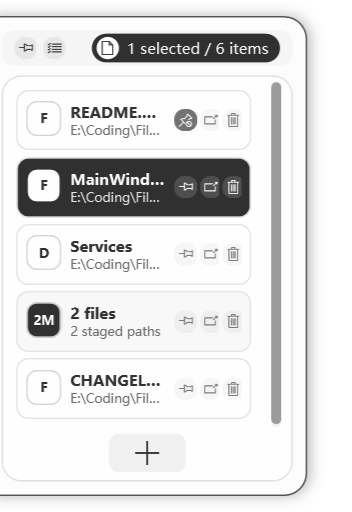

<p align="center">
  
</p>

<h1 align="center">FileShelf</h1>

<p align="center">
  A portable Windows file shelf for temporarily staging files and folders between Explorer windows or applications.
</p>

<p align="center">
  English | <a href="README_zh.md">简体中文</a>
</p>

FileShelf is a small always-on-top shelf for paths you need again soon. Drop files or folders into it, keep them visible, then drag them out into another Explorer window or application.

FileShelf stores file paths only. It does not copy, move, delete, modify, upload, or read file contents, and it does not manage clipboard history.

## Basic Use

1. Start `FileShelf.Win.exe`. FileShelf opens as a floating folder icon near the edge of the screen and also appears in the system tray.
2. Add files or folders by dragging them from Explorer onto the floating icon or the opened shelf panel. You can also open the panel and use the `+` button to add files or a folder manually.
3. Open the shelf when you need the staged paths: double-click the floating icon, or left-click the tray icon.
4. Drag items out of FileShelf into Explorer or another app. You can drag a single item, selected items, or the item-count handle at the top of the shelf.
5. After a successful drag-out, unpinned entries are removed from FileShelf only. The original files and folders stay where they are.

The intended workflow is simple: collect paths, keep them ready, drag them to the next place. Use pinning only for entries you want to keep after drag-out or clear operations.

## How It Feels

| Stage files | Keep them ready | Drag them out |
| --- | --- | --- |
| Drop files or folders onto the floating FileShelf icon or the opened shelf panel. | Pinned items, grouped drops, selected items, and missing-file hints stay visible in the shelf. | Drag one item, a selection, or the item-count handle into Explorer or another app. |

## Running Screenshot

<p align="center">
  
</p>

## Main Features

- Portable Windows app: no installer, registry keys, shell extensions, or background services; optional startup uses one current-user Startup shortcut.
- Always-on-top shelf for temporary file and folder staging.
- Drag files or folders into the shelf; files dropped together stay as one group.
- Drag staged items back out through standard Windows file drag/drop.
- Successful drag-out removes unpinned entries from FileShelf only; source files stay untouched.
- Pin important shelf items so they remain after drag-out or clear operations.
- Stack selected shelf items into one group, or split a group back into separate entries.
- Restore recently removed entries during the current app session.
- Tray icon control: left click toggles the shelf, right click opens Settings, About, or Exit.
- Always-on-top floating folder icon: double-click opens the shelf panel, drag it to reposition, and drop files onto it to stage.
- Configurable language, startup behavior, and data path.
- Chinese and English interface switching.

## For Users

### Download and Run

Download the portable Windows build, unzip it, and run:

```text
FileShelf.Win.exe
```

No installation is required. Runtime data is stored beside the executable by default, so the app folder can be moved as a portable package.

### Everyday Workflow

Use FileShelf as a temporary handoff area:

1. Put paths in: drag files or folders onto the floating folder icon, or open the shelf and drop them into the panel.
2. Keep context: leave the shelf collapsed as the floating icon while you work elsewhere.
3. Take paths out: open the shelf and drag the needed item, selection, group, or count handle into the target app.

Files dropped together become one shelf group. Dragging that group out sends all paths in the group together. If you need separate handling later, use the item context menu to split the group.

### Controls

- Floating folder icon: double-click to open the shelf panel.
- Floating folder icon drag: move the icon to another screen position.
- Floating folder icon drop target: release files over the icon to stage them; moving away cancels the interaction.
- Focus change: collapse the shelf panel back to the floating icon.
- Tray left click: open or collapse the shelf panel.
- Tray right click: open Settings, About, or Exit.
- Shelf `+` button: add files or folders manually, select all for drag-out, restore recently removed entries, or clear unpinned entries.
- Item click: select an item for batch drag-out or item actions.
- Item drag: drag that item, or the current selection, out to another app.
- Item-count handle: drag selected items out; when nothing is selected, drag every staged item out.
- Item context menu: open, reveal in Explorer, pin/unpin, stack selected items, split a group, or remove.

### Safety and Portability

- Source files are never modified by FileShelf.
- Removing an item from the shelf only removes FileShelf's saved path metadata.
- Runtime state defaults to `FileShelfData` beside the executable.
- Settings are stored in `FileShelfData\settings.json`.
- Shelf metadata is stored in `FileShelfData\shelf.json`.
- Build metadata is compiled into the assembly; About version text and update checks do not require a sidecar metadata file.
- FileShelf does not register global hotkeys or mouse hooks.
- When startup is enabled in Settings, FileShelf creates only `%APPDATA%\Microsoft\Windows\Start Menu\Programs\Startup\FileShelf.Win.lnk`; disabling startup removes that shortcut.
- If the app crashes, FileShelf leaves only its portable data and log files.

## For Developers

### Requirements

- Windows
- .NET SDK 10.x
- PowerShell

### Build From Source

Run from the repository root:

```powershell
dotnet restore FileShelf.sln -r win-x64
dotnet build FileShelf.sln -c Release --no-restore
```

Run during development:

```powershell
dotnet run --project src\FileShelf.Win\FileShelf.Win.csproj
```

Create a clean portable build:

```powershell
.\scripts\publish-portable.ps1
```

The output is written to:

```text
artifacts\FileShelf-portable-win-x64
```

The publish script removes runtime `FileShelfData` state and `.pdb` files from the portable output.
When `-Version` is omitted, it uses the project version from `Directory.Build.props`.

To stamp a specific app version:

```powershell
.\scripts\publish-portable.ps1 -Version 0.5.0
```

To enable About-window update checks against GitHub Releases:

```powershell
.\scripts\publish-portable.ps1 -Version 0.5.0 -Repository lartpang/FileShelf
```

The version and repository metadata are compiled into the app assembly.

### Project Layout

- `FileShelf.sln`: solution file for IDEs and command-line builds.
- `src\FileShelf.Win\`: WPF application source.
- `src\FileShelf.Win\Resources\`: application logo and icon asset.
- `src\FileShelf.Win\Services\`: settings, tray, drag/drop, and state services.
- `src\FileShelf.Win\Models\`: shelf item and settings models.
- `scripts\publish-portable.ps1`: clean portable publish script.
- `.github\workflows\release.yml`: GitHub Actions release workflow.
- `reference\`: external reference screenshots and notes used during UI/function alignment.

### GitHub Release Automation

This repository includes a workflow that publishes a portable Windows zip when a version tag is pushed.

Use semantic version tags:

```powershell
git tag v0.5.0
git push origin v0.5.0
```

The workflow will:

1. Check out the tagged source.
2. Install .NET 10.x on a Windows runner.
3. Restore and publish `FileShelf.Win` for `win-x64`.
4. Stamp the app version from the tag into the assembly, for example `v0.5.0` -> `0.5.0`.
5. Zip the clean portable output.
6. Create a GitHub Release and upload the zip asset.

You can also run the workflow manually from GitHub Actions with an existing tag such as `v0.5.0`.

If release creation fails with a permission error, open the GitHub repository settings and ensure Actions can create releases. The workflow itself requests only `contents: write`.

### Development Notes

- Keep the app portable: do not add installers, registry writes, shell extensions, or background services; keep startup opt-in limited to the current-user Startup shortcut.
- Keep the file-shelf scope narrow: do not add clipboard history or file-content indexing.
- Treat staged files as external user data: store paths only.
- Prefer small WPF changes that preserve the current shelf-first workflow.
- After changes, run:

```powershell
dotnet build FileShelf.sln -c Release --no-restore
.\scripts\publish-portable.ps1
```
